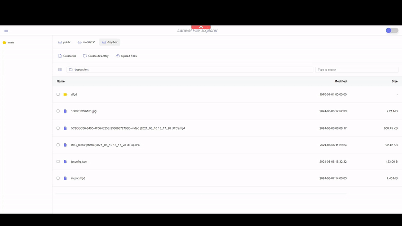

# Laravel File Explorer


Laravel File Explorer is a package for easy file management in Laravel apps, offering features like browsing, uploading, and deleting files.

## Features



- Frontend made with VueJS 3
- Light/dark mode toggle
- Utilizes Laravel Flysystem standards for file system operations
- Supports Local, FTP, S3, Dropbox, and other storage options
- Supports File System Operations:
    - CURD operations files and directories
    - Multi-upload functionality
    - Download files
    - Image preview
    - Video player
    - Audio player
    - Code editor (Codemirror)
    - Laravel events
    - ACL

## Installation

Install Laravel File Explorer with composer

```bash
  composer require alireza-moh/laravel-file-explorer
```
Publish configuration file<br>
```bash
  php artisan vendor:publish --tag=lfx.config
```
Download the frontend into your project

https://github.com/Alireza-Moh/laravel-file-explorer-frontend

```bash
  npm i laravel-file-explorer
```
Add the FileExplorer component to the vue app
```js
import LaravelFileExplorer from "laravel-file-explorer";
import "laravel-file-explorer/dist/style.css";

app.use(LaravelFileExplorer);
```
Use the component inside your vue component
```javascript
  <LaravelFileExplorer :setting="{baseUrl: 'http://laravel-wrapper.localhost:8084/api/laravel-file-explorer/'}"/>
```

## Enable ACL
The Laravel File Explorer with ACL (Access Control List) lets you control what each user can do with files.
You can give permissions to each user like creating, reading, updating, deleting, uploading, and downloading files.

Setup: [ACL DOC](docs/ACL.md)


## Using Dropbox for Laravel Storage

The Laravel Flysystem integration provides simple drivers for working with local filesystems, SFTP, and Amazon S3

Laravel Documentation: [Doc](https://laravel.com/docs/11.x/filesystem#configuration)


- For using Dropbox install the `spatie/flysystem-dropbox` via composer
- For using AWS S3 install the `league/flysystem-aws-s3-v3` via composer
- For using FTP install the `league/flysystem-ftp` via composer
- For using SFTP install the `league/flysystem-sftp-v3` via composer
