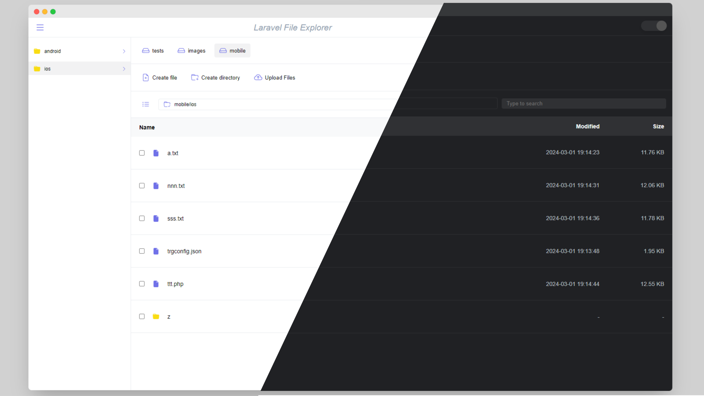

# Laravel File Explorer




Laravel File Explorer is a package for easy file management in Laravel apps, offering features like browsing, uploading, and deleting files. Ideal for content management systems and file storage solutions.


## Features

- Frontend mae with Vuejs 3
- Light/dark mode toggle
- Utilizes Laravel Flysystem standards for file system operations
- Supports Local, FTP, S3, Dropbox, and other storage options
- Enables selective disk interaction for precise file management
- Supports File System Operations:
    - Create and manage files with ease
    - Organize content efficiently through directory creation
    - Seamlessly rename files and directories
    - Enable multi-upload functionality for efficient file transfers
    - Facilitate downloading files
    - Intuitive image preview feature for quick visual assessment
    - Enhance image viewing
    - Integrated video player
    - Built-in code editor for quick edits and customization
    - Code editor
    - Backend events for enhanced monitoring


## Installation

Install Laravel File Explorer with composer

```bash
  composer install alireza/laravel-file-explorer
```
Publish configuration file

```bash
  php artisan vendor:publish --tag=lfx.config
```
Download the frontend into your project

```bash
  npm install laravel-file-explorer
```
Add the FileExplorer component to the vue app
```javascript
import LaravelFileExplorer from "laravel-file-explorer";
import "laravel-file-explorer/dist/style.css";

app.use(LaravelFileExplorer);
```
Use the component inside your vue component
```javascript
  <LaravelFileExplorer setting="{baseUrl: 'http://laravel-wrapper.localhost:8084/api/laravel-file-explorer/'}"/>
```
